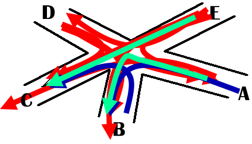

```markdown
# 🚦 五岔路口交通管理系统（图着色算法问题）

> 作者：Jia'nan Zhao  
> 时间：2020年12月  
> 课程题目：数据结构课程设计  
> 技术栈：C语言 + 邻接矩阵 + 图着色算法
```
---

## 🧩 项目简介



本项目旨在通过图论的思路，设计一个**五岔路口交通灯控制系统**。通过模拟实际道路冲突关系，使用图的着色算法为每条路线分配“信号灯颜色”，以实现：
- 🚗 各路线互不冲突；
- 🚥 信号灯切换最优化；
- 🚦 通行效率最大化。

核心思路是将**交通通行路线抽象为图的顶点**，路线冲突抽象为**边连接的顶点**，最终将问题转化为**图顶点最小着色问题**。

---

## 🎯 功能特性

- 👁 可视化五岔路口的13条通行路线。
- 🧠 利用邻接矩阵构建交通冲突模型。
- 🎨 实现图的着色算法，分组冲突路线。
- 🧑‍💻 提供交互式菜单，输出信号灯方案。
- 📊 显示最小颜色数（信号周期数）及各组通行路线。

---

## 🧮 模型设计

### 📍 路口通行路径（共13条）

```

AB  AC  AD
BA  BC  BD
DA  DB  DC
EA  EB  EC  ED

```

### 🔗 冲突关系建模（邻接矩阵）

- 使用二维数组 `e[13][13]` 表示冲突关系。
- 若路线 i 与 j 冲突，则 `e[i][j] = 1`。
- 示例代码：

```c
int e[13][13] = {
    {0, 0, 0, 0, 1, 1, 1, 0, 0, 1, 0, 0, 0},
    ...
};
```

---

## 🎨 着色算法说明

目标：将所有通行路线分组，使得同组内路线无冲突，即图中**无边连接的顶点使用同一颜色**。

### 着色策略

1. 使用 `v[13]` 初始化为 -1 表示未上色；
2. 每次从未上色顶点出发，尽可能多地标记同色；
3. 重复直到全部节点着色完毕；
4. 输出颜色数及对应路线编号。

### 关键函数

```c
void streetlamp() {
    ...
    printf("第%d种颜色节点：%d %d ...\n", 颜色编号, 路线编号...);
}
```

---

## 💻 使用说明（本地运行）

### 🧱 编译方式

```bash
gcc traffic_lamp.c -o traffic_lamp
./traffic_lamp
```

### 📋 控制菜单

```text
-------------操作选项-----------
1: 返回菜单
2: 退出程序
3: 输出涂色方案
--------------------------------
```

---

## ✅ 测试样例输出

```text
第1种颜色节点：0 1 2 3 8 12
第2种颜色节点：4 5 9
第3种颜色节点：6 7
第4种颜色节点：10 11
总共4种颜色
```

🚦 表示仅需4种信号灯颜色轮替，即可完成全路口最优调度。

---

## 📈 性能分析

* 时间复杂度：**O(n²)**，采用三重嵌套循环遍历邻接矩阵；
* 内存消耗小，适合嵌入式或微控制器类本地部署。

---

## 🧠 项目总结

本项目是一次将**图论知识与实际生活问题结合**的有趣实践，学会了：

* 抽象实际问题为图模型；
* 使用邻接矩阵与图着色算法求解最优化方案；
* 设计结构清晰的交互式 C 语言系统；
* 理解数据结构在真实场景下的运用价值。

---

## 📚 参考资料

* 《数据结构（C语言版）》— 严蔚敏、吴伟民
* 《C语言程序设计》— 马秀丽、刘志妩、李筠

---


> 若你对交通管理优化、图算法、或C语言项目感兴趣，欢迎交流！

---

